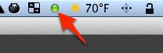

# StartingBlocks::Stopplicht

Adds support for stopplicht in starting blocks.  When your tests are run, the stopplicht light in your OSX toolbar will change from yellow/red/green, depending on the state of the starting blocks run.



## Usage


Include "--stopplicht" when using starting blocks.

```
sb --stopplicht
```

## Installation

Install stopplicht from NPM at

https://www.npmjs.org/package/stopplicht

Add this line to your application's Gemfile:

    gem 'starting_blocks-stopplicht'

And then execute:

    $ bundle

Or install it yourself as:

    $ gem install starting_blocks-stopplicht


## Contributing

1. Fork it
2. Create your feature branch (`git checkout -b my-new-feature`)
3. Commit your changes (`git commit -am 'Add some feature'`)
4. Push to the branch (`git push origin my-new-feature`)
5. Create new Pull Request
